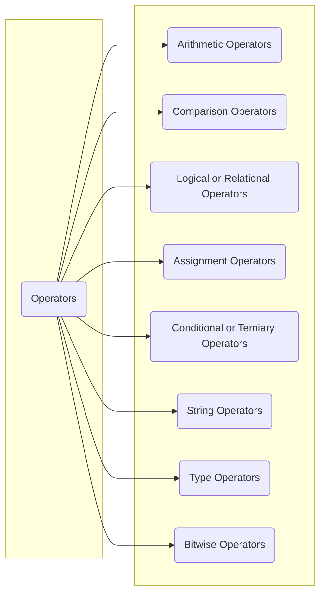
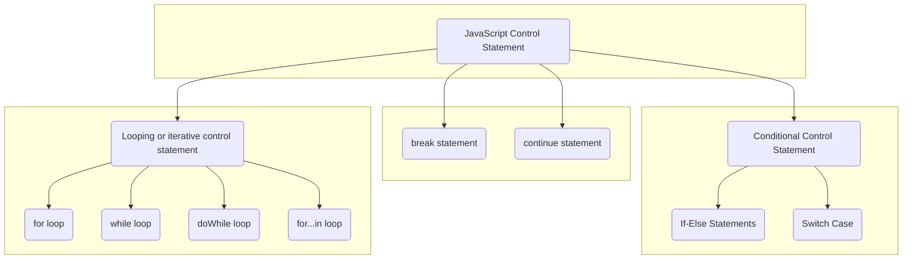

# TeluskoJS

This is my repository where I practice js codes

## Testing different headings

List of things I am going to learn writing readme.md document

1. Javascript
   * Functions
   * Objects
   * Modules
   * Separation of concerns
   * Access controls
   * Logging
   * Building RESTful APIs
   * Feature Toggle
   * Internalization
2. Other featurs of JS

---

## Operators in Javasript

### Definition

Javascript operators are symbols which are used to assign values, compare values, perfor arithmetic operations, and more.

* The variables (Operations) are called operands.
* The operation (to be performed between the two operands) is defined by an operator.



### Arithmetic Operators

Arithmetic operators perform arithmetic operations on numbers.

| Operator |       Description |
| :------- | ----------------: |
| +        |          Addition |
| -        |       Subtraction |
| *        |    Multiplication |
| /        |          Division |
| %        | Modulus(Reminder) |
| ++       |         Increment |
| --       |         Decrement |

### Comparison Operators

Comparision and Logical operators are used to test for true or false.

Comparison operators are used in logical statements to determine equality or difference between variables or values. 

Given that x = 5, the table below explains the comparison operators:

| Operators |            Description            |             Comparing | Returns           |
| :-------- | :-------------------------------: | --------------------: | :---------------- |
| ==        |             equal to              |    x==8, x==5, x=="5" | false, true, true |
| ===       |    equal value and equal type     |        x===5, x==="5" | true, false       |
| !=        |             not equal             |                  x!=8 | true              |
| !==       | not equal value or not equal type | x!==5, x!=="5", x!==8 | false, true, true |
| >         |           greater than            |                   x>8 | false             |
| <         |             Less than             |                   x<8 | true              |
| >=        |     greater than or equal to      |                  x>=8 | false             |
| <=        |       less than or equal to       |                  x<=8 | true              |

### Logical or Relational Operators

Comparison and Logical operators are used to test for true or false. Logical operators are used to determine the logic between variables or values.

Given that x=6 and y=3, the table below explains the logical operators

| Operator | Description |                          Example |
| :------- | :---------: | -------------------------------: |
| ```&&``` |     and     |  ```(x < 10 && y > 1)``` is true |
| ```||``` |     or      | ```(x == 5 ||y == 5)``` is false |
| ```!```  |     not     |          ```!(x == y)``` is true |

### Assignment Operators

Assignment operators assign values to javascript variables

| Operator   |    Example     |           Same as |
| :--------- | :------------: | ----------------: |
| ```=```    |  ```x = y```   |       ```x = y``` |
| ```+=```   |  ```x += y```  |   ```x = x - y``` |
| ```-=```   |  ```x -= y```  |   ```x = x - y``` |
| ```*=```   |  ```x *= y```  |     ```x = x*y``` |
| ```/=```   |  ```x /= y```  |     ```x = x/y``` |
| ```%=```   |  ```x %= y```  |     ```x = x%y``` |
| ```<<=```  | ```x <<= y```  |  ```x = x << y``` |
| ```>>=```  | ```x >>= y```  |  ```x = x >> y``` |
| ```>>>=``` | ```x >>>= y``` | ```x = x >>> y``` |
| ```&=```   |  ```x &= y```  |   ```x = x & y``` |
| ```^=```   |  ```x ^= y```  |     ```x = x^y``` |
| ```|=```   |  ```x |= y```  |     ```x = x|y``` |
| ```**=```  | ```x **= y```  |    ```x = x**y``` |

### Conditional (Ternary) Operator

Javascript also contains a conditional operator that assignsla avalue to a variable based on some condition.

_syntax_ -
> ```variable name = (condition) ?  value1 : value2```

### String Operators

The **+** operator can also be used to add (concatenate) strings.

```javascript
var txt1 = "John";
var txt2 = "Doe";
var txt3 = txt1 + " " + txt2;
```

Output
> John Doe

### Type Operator

Used to determind the type of data being stored in variable.

| Operator         |                                                Description |
| :--------------- | ---------------------------------------------------------: |
| ```typeof```     |                             Returns the type of a variable |
| ```instanceof``` | Returns true if an object is an instance of an object type |

### Bitwise Operator

Bit operators work on 32 bits numbers. Any numeric operand in the operation is converted into a 32 bit number. The result is converted back to a JavaScript number.

| Operator  |            Descripton |
| :-------- | --------------------: |
| ```&```   |                   AND |
| ```|```   |                    OR |
| ```~```   |                   NOT |
| ```^```   |                   XOR |
| ```<<```  |  Zero fill left shift |
| ```>>```  |    Signed right shift |
| ```>>>``` | Zero fill right shift |

### Associativity

>```+``` is left to right associativity.  

When string is found it will start concatenation operation with rest of the variables.

In general arithmetic operators follow [BODMAS](https://www.mathsisfun.com/operation-order-bodmas.html) rule.

## Flow control in JavaSript

JS control statements also known as control structures or flow control statements are statements which decide the execution flow of the program

Typically the program execution begins from the first line in the to the last line of that JS code. However, in between this the flow of the execution can be branched (based on some condition) or re-iterated (loops) based on some criterias. This the functionality that is provided by Control Statements in JavaScript.

> START
code statement 1
code statement 2 ...



## Sources

1. Javascript tutorials by [TeluskoJS](https://www.youtube.com/playlist?list=PLsyeobzWxl7qtP8Lo9TReqUMkiOp446cV)
2. [MDN](https://developer.mozilla.org/en-US/docs/Web)
